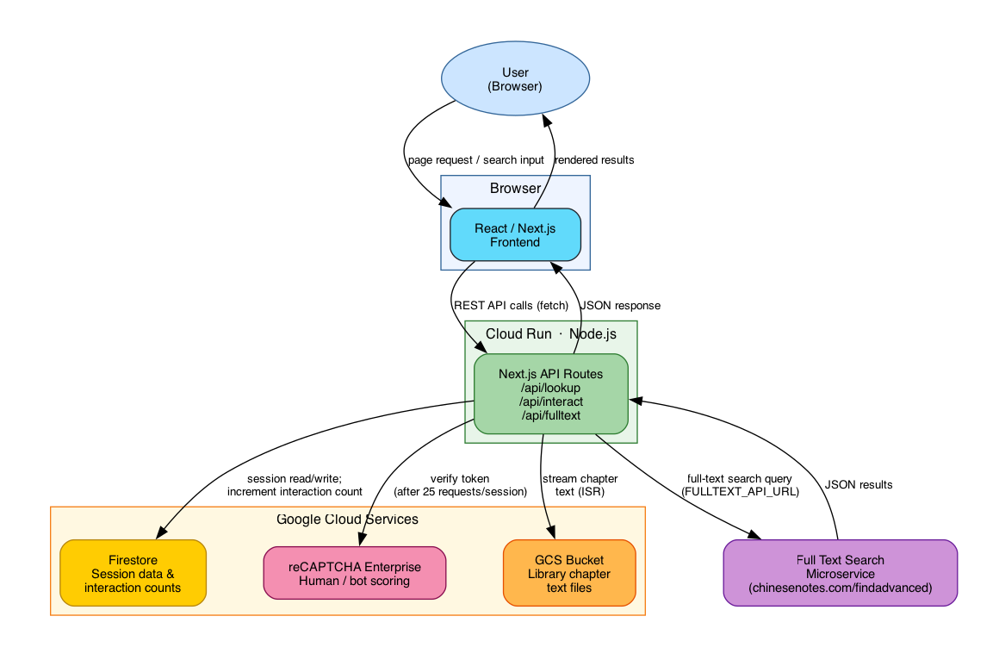

# chinesenotes-frontend

Frontend for a Chinese-English dictionary, supporting [chinesenotes.com](https://chinesenotes.com), [ntireader.org](https://ntireader.org), and [hbreader.org](https://hbreader.org).

Built with Next.js 16 App Router and TypeScript. The same codebase serves all three sites; a `SITE_THEME` environment variable controls the colour scheme and which library texts are shown.

## Features

- **Dictionary lookup** — full-text search over 167,000 entries with multi-sense display and pinyin
- **Text segmentation** — greedy longest-match segmentation of Chinese input into dictionary words
- **Library reader** — browse classical texts chapter by chapter; click any word to see its definition inline
- **Multi-site theming** — `demo`, `chinesenotes`, `ntireader`, `hbreader` themes via a single env var
- **Contains search** — "Other terms containing this term" link on every entry detail page; backed by a precomputed substring index (`data/substring-index.json`) built from the dictionary at compile time
- **Bot protection** — signed session cookies block direct API scraping; interaction counts stored in Firestore enforce Google reCAPTCHA Enterprise after 25 requests per session per day

## Development

Prerequisites: Node.js 20+.

Install dependencies:

```shell
npm install
```

Copy the example env file and fill in the required values:

```shell
cp .env.local.example .env.local
```

Key variables (see `.env.local.example` for the full list and comments):

| Variable | Required locally | Description |
|---|---|---|
| `SITE_THEME` | No (defaults to `demo`) | `demo` \| `chinesenotes` \| `ntireader` \| `hbreader` |
| `TEXT_BUCKET` | Yes (for Library reader) | GCS bucket holding chapter text files, e.g. `my-chinesenotes-text` |
| `SESSION_SECRET` | Yes (for bot protection) | 32-byte hex secret — generate with `openssl rand -hex 32` |
| `GOOGLE_CLOUD_PROJECT` | Yes (for Firestore + reCAPTCHA) | GCP project ID — set automatically by Cloud Run in production |
| `NEXT_PUBLIC_RECAPTCHA_SITE_KEY` | No (disables reCAPTCHA if unset) | Score-based reCAPTCHA Enterprise site key |
| `NEXT_PUBLIC_GA_TAG` | No (defaults to `G-03MVHHCXJ6`) | Google Analytics measurement/tracking ID — baked in at build time |

Firestore and reCAPTCHA Enterprise both use Application Default Credentials. Authenticate locally with:

```shell
gcloud auth application-default login
```

Start the dev server:

```shell
npm run dev
```

Open http://localhost:3000.

> **Bundler note:** Turbopack requires native ARM64 binaries that are not installed. All scripts use `--webpack` to force the webpack bundler. Do not remove that flag.

### Dictionary data

The dictionary is loaded from `data/dictionary.json` at startup. This file is generated by `scripts/copy-dictionary.mjs`, which is run automatically as a `predev`/`prebuild` hook. The source files are selected by the `SITE` environment variable:

| `SITE` | Source repo | Source files |
|---|---|---|
| *(unset)* | — | Keeps `data/dictionary.json` if it already exists; otherwise falls back to `assets/example_dictionary.json` |
| `demo` | — | `assets/example_dictionary.json` (small subset, no sibling repo needed) |
| `chinesenotes` | `../chinesenotes.com` | `data/cnotes_zh_en_dict.tsv`, `data/modern_named_entities.txt`, `data/translation_memory_literary.txt`, `data/translation_memory_modern.txt` |
| `ntireader` | `../buddhist-dictionary` | `data/dictionary/buddhist_named_entities.txt`, `data/dictionary/buddhist_terminology.txt`, `data/dictionary/cnotes_zh_en_dict.tsv`, `data/dictionary/fgs_mwe.txt`, `data/dictionary/translation_memory_buddhist.txt`, `data/dictionary/translation_memory_hsingyun.txt`, `data/dictionary/translation_memory_literary.txt` |
| `hbreader` | `../hbreader` | `data/dictionary/buddhist_named_entities.txt`, `data/dictionary/buddhist_terminology.txt`, `data/dictionary/cnotes_zh_en_dict.tsv`, `data/dictionary/fgs_mwe.txt`, `data/dictionary/modern_named_entities.txt`, `data/dictionary/translation_memory_buddhist.txt`, `data/dictionary/translation_memory_hsingyun.txt`, `data/dictionary/translation_memory_literary.txt`, `data/dictionary/translation_memory_modern.txt` |

To build the dictionary manually for a specific site:

```shell
SITE=chinesenotes node scripts/copy-dictionary.mjs
```

If none of the configured source files are found, the script falls back to keeping an existing `data/dictionary.json` if present, or copying `assets/example_dictionary.json` otherwise.

#### Substring index

`scripts/build-substring-index.mjs` reads `data/dictionary.json` and writes `data/substring-index.json` — a reverse index mapping every dictionary headword to the list of longer headwords that contain it as a substring (sorted by decreasing length, capped at 50). This powers the "Other terms containing this term" feature on entry detail pages.

The script runs automatically as part of the `predev` and `prebuild` hooks and skips rebuilding if the index file is already newer than the dictionary. It can also be run manually:

```shell
node scripts/build-substring-index.mjs
```

### Corpus

The library feature is driven by a corpus repo that depends on `SITE_THEME`. For local development, check out the appropriate repo as a sibling directory:

| `SITE_THEME` | Repo | Local path |
|---|---|---|
| `chinesenotes` / `demo` | [chinesenotes.com](https://github.com/alexamies/chinesenotes.com) | `../chinesenotes.com/` |
| `ntireader` | [buddhist-dictionary](https://github.com/alexamies/buddhist-dictionary) | `../buddhist-dictionary/` |
| `hbreader` | [hbreader](https://github.com/alexamies/hbreader) | `../hbreader/` |

Each repo must contain:

```
data/corpus/
  collections.csv     # master list of all works (one per line, tab-separated)
  daodejing.csv       # per-book chapter index (one per work)
  ...
```

`collections.csv` columns (tab-separated):

```
csvFile  htmlFile  title  description  introFile  corpus  language  period  genre
```

Each per-book CSV lists chapters:

```
sourcePath  htmlPath  chapterTitle
```

where `sourcePath` is of the form `bookId/chapterId.txt` — the same path used to fetch the file from the GCS bucket named by `TEXT_BUCKET`.

Chapter text files are **not** stored in git. They live in a GCS bucket and are fetched at request time using Application Default Credentials (your local `gcloud auth application-default login` in dev; the Cloud Run service account in production). Set `TEXT_BUCKET` to the name of that bucket.

## Bot protection

Every browser that loads any page receives a signed `HttpOnly SameSite=Strict` session cookie (`cn_sid`) set by the Next.js proxy layer. The cookie value is `{uuid}.{HMAC-SHA256(SESSION_SECRET, uuid)}`.

Every request to `/api/lookup` must present this cookie. The server:

1. Verifies the HMAC signature — forged cookies are rejected with 403.
2. Atomically increments a per-session daily counter in Firestore (`sessions/{sessionId}` → `{ count, date }`). The counter resets to 1 when the date changes.
3. Once `count > 25`, a valid reCAPTCHA Enterprise token must accompany the request. The token is verified server-side using the Cloud Run service account (ADC) — no API key is needed.

Direct HTTP scrapers (curl, Python requests, etc.) that never load a page will not have a session cookie and receive 401. Scrapers that do manage cookies are subject to Firestore counting and reCAPTCHA scoring.

The client tracks the last `interactionCount` returned by the server so it can proactively fetch a reCAPTCHA token before hitting the threshold. A one-shot retry path handles the edge case where a browser session resumes mid-day above the threshold.

"Details →" link clicks in search results are also tracked via a fire-and-forget `POST /api/interact` call so they count toward the daily total alongside searches and chapter-reader taps.

## Project structure

```
src/
  proxy.ts                            # sets the signed session cookie on every response
  app/
    page.tsx                          # dictionary home page
    library/
      page.tsx                        # library index (lists all works from collections.csv)
      [bookId]/
        page.tsx                      # chapter list (pre-rendered for all books at build time)
        [chapter]/
          page.tsx                    # chapter reader (ISR, fetches text from GCS at request time)
    api/
      lookup/route.ts                 # dictionary lookup API (session-gated, Firestore-counted,
                                      # reCAPTCHA-enforced above threshold)
      interact/route.ts               # records a link-click interaction in Firestore
    entry/[term]/page.tsx             # full entry detail page
  components/
    ChapterReader.tsx                 # interactive reader (click word → definition panel)
    DictionaryApp.tsx                 # search input + results
    TrackedLink.tsx                   # <Link> wrapper that posts to /api/interact on click
    Header.tsx / HamburgerMenu.tsx    # site chrome
  lib/
    corpus.ts                         # reads collections.csv and per-book CSVs; fetches chapter
                                      # text from GCS via @google-cloud/storage
    dictionary.ts                     # loads dictionary index from data/dictionary.json
    firestore.ts                      # Firestore client; incrementInteraction()
    recaptcha.ts                      # client-side reCAPTCHA token helper; threshold state
    segmentation.ts                   # greedy longest-match segmentation
    session.ts                        # session cookie generation and HMAC verification
                                      # (Web Crypto API — works in Edge proxy and Node.js)
```

## Deployment

The app deploys to Google Cloud Run via Cloud Build. `SITE_THEME` is passed as a Docker build argument so that Next.js bakes the correct theme into statically pre-rendered pages at build time.

### One-time setup

Configure gcloud and select the right project:

```shell
gcloud config configurations create chinesenotes-demo
gcloud config configurations activate chinesenotes-demo
gcloud init
```

Create the Artifact Registry repository (if it does not already exist):

```shell
gcloud artifacts repositories create cloud-run-source-deploy \
  --repository-format docker --location us-central1
```

Grant the Cloud Run service account read access to the GCS text bucket (substitute your `TEXT_BUCKET` value):

```shell
gcloud storage buckets add-iam-policy-binding gs://${TEXT_BUCKET} \
  --member=serviceAccount:${SERVICE_ACCOUNT_EMAIL} \
  --role=roles/storage.objectViewer
```

Grant the Cloud Run service account access to Firestore:

```shell
gcloud projects add-iam-policy-binding ${PROJECT_ID} \
  --member=serviceAccount:${SERVICE_ACCOUNT_EMAIL} \
  --role=roles/datastore.user
```

Grant the Cloud Run service account access to reCAPTCHA Enterprise (to create assessments):

```shell
gcloud projects add-iam-policy-binding ${PROJECT_ID} \
  --member=serviceAccount:${SERVICE_ACCOUNT_EMAIL} \
  --role=roles/recaptchaenterprise.agent
```

Store `SESSION_SECRET` in Secret Manager and grant the Cloud Run service account access to it:

```shell
echo -n "$SESSION_SECRET" | gcloud secrets create session-secret --data-file=-
gcloud secrets add-iam-policy-binding session-secret \
  --member=serviceAccount:${SERVICE_ACCOUNT_EMAIL} \
  --role=roles/secretmanager.secretAccessor
```

Mount the secret and set runtime env vars on the Cloud Run service. `GOOGLE_CLOUD_PROJECT` is injected automatically by Cloud Run and does not need to be set manually.

```shell
gcloud run services update ${SERVICE_NAME} \
  --region ${REGION} \
  --update-secrets SESSION_SECRET=session-secret:latest \
  --update-env-vars NEXT_PUBLIC_RECAPTCHA_SITE_KEY=${SITE_KEY},TEXT_BUCKET=${TEXT_BUCKET}
```

Chapter pages are rendered at request time (ISR, 24-hour cache) and fetch text from `gs://${TEXT_BUCKET}` using the Cloud Run service account credentials.

### Building static assets before deploying

Two files must be built locally before submitting to Cloud Build, because the source repos are not available there. Set `SITE` to match the deployment target:

```shell
SITE=chinesenotes node scripts/copy-dictionary.mjs   # chinesenotes.com
SITE=ntireader    node scripts/copy-dictionary.mjs   # ntireader.org
SITE=hbreader     node scripts/copy-dictionary.mjs   # hbreader.org
```

This writes `data/dictionary.json`. The `.gcloudignore` file overrides `.gitignore` to include `data/` in the Cloud Build upload so the pre-built file is available inside the Docker build.

`data/substring-index.json` does **not** need to be built locally before submitting. The `prebuild` hook runs `build-substring-index.mjs` inside the Docker container, which builds the index from the uploaded `data/dictionary.json` automatically.

The references and abbreviations page HTML must also be copied locally before deploying. The `ntireader` and `hbreader` source repos are private and cannot be cloned inside the Docker build:

```shell
SITE=chinesenotes node scripts/copy-references.mjs   # chinesenotes.com
SITE=ntireader    node scripts/copy-references.mjs   # ntireader.org
SITE=hbreader     node scripts/copy-references.mjs   # hbreader.org
```

This writes `assets/references.html` and `assets/abbreviations.html`, which are included in the Cloud Build upload and baked into the statically pre-rendered `/references` and `/abbreviations` pages at build time.

### Deploy

```shell
gcloud builds submit --config cloudbuild.yaml \
  --substitutions _SITE_THEME=chinesenotes,_SERVICE_NAME=${SERVICE_NAME},_TEXT_BUCKET=${TEXT_BUCKET} .
```

This runs three Cloud Build steps:

1. `docker build` — sparse-clones the corpus CSV index files from the repo matching `SITE_THEME` (e.g. `github.com/alexamies/buddhist-dictionary` for ntireader), then builds the Next.js app with `SITE_THEME` baked in
2. `docker push` — pushes to Artifact Registry
3. `gcloud run deploy` — deploys to Cloud Run and sets `SITE_THEME` and `TEXT_BUCKET` as runtime env vars

Override substitutions for the other sites. Each site has a distinct Google Analytics tag which must be passed via `_GA_TAG` so it is baked into the static build:

| Site | `_SITE_THEME` | `_GA_TAG` |
|---|---|---|
| chinesenotes.com | `chinesenotes` | `G-03MVHHCXJ6` (default — can be omitted) |
| ntireader.org | `ntireader` | `UA-57634593-1` |
| hbreader.org | `hbreader` | `UA-106394250-1` |

```shell
# ntireader.org
gcloud builds submit --config cloudbuild.yaml \
  --substitutions _SITE_THEME=ntireader,_SERVICE_NAME=${SERVICE_NAME},_GA_TAG=UA-57634593-1,_TEXT_BUCKET=${TEXT_BUCKET} .

# hbreader.org
gcloud builds submit --config cloudbuild.yaml \
  --substitutions _SITE_THEME=hbreader,_SERVICE_NAME=${SERVICE_NAME},_GA_TAG=UA-106394250-1,_TEXT_BUCKET=${TEXT_BUCKET} .
```

### Rendering strategy

| Route | Strategy | Data source |
|---|---|---|
| `/library` | Static (build time) | `collections.csv` cloned in Dockerfile |
| `/library/[bookId]` | Static (build time) | per-book `.csv` cloned in Dockerfile |
| `/library/[bookId]/[chapter]` | ISR (24 h cache) | GCS bucket (`TEXT_BUCKET`) at request time |
| `/entry/[term]` | Static (build time) | `data/dictionary.json` |

### Why SITE_THEME and NEXT_PUBLIC_GA_TAG are build-time arguments

Next.js pre-renders static and SSG pages at `npm run build` time. If `SITE_THEME` were only a Cloud Run runtime variable it would not be visible during the build, and pre-rendered pages would fall back to the `demo` theme. Passing it as a Docker `ARG` and `ENV` before `npm run build` ensures the theme is baked correctly into all pre-rendered library and entry pages.

`NEXT_PUBLIC_GA_TAG` (prefixed `NEXT_PUBLIC_`) is inlined into the client bundle by Next.js at build time; it is not available at runtime. It must therefore also be passed as a Docker `ARG` so it is present when `npm run build` runs inside the container.

## Available commands

| Command | Description |
|---|---|
| `npm run dev` | Start dev server at http://localhost:3000 |
| `npm run build` | Production build |
| `npm run lint` | ESLint |
| `npm test` | Run unit tests (Vitest) |

## Architecture

The system is composed of six main components. The source diagram is in [`drawings/architecture.dot`](drawings/architecture.dot); see [`drawings/README.md`](drawings/README.md) for how to regenerate the PNG.



### React / Next.js Frontend (browser)

The UI is a React single-page app built with Next.js App Router. Users type Chinese characters, English, or pinyin into the search box. The component sends `fetch` requests to the Next.js API routes and renders the results — segmented Chinese terms with dictionary entries, or a reverse-lookup table for English/pinyin queries. The library reader, chapter viewer, and entry detail pages are also part of this layer.

### Node.js Backend — Next.js API Routes (Cloud Run)

The server-side layer runs on Node.js inside a Cloud Run container. It exposes three REST endpoints:

| Endpoint | Purpose |
|---|---|
| `GET /api/lookup` | Dictionary lookup — Chinese segmentation or reverse English/pinyin lookup |
| `POST /api/interact` | Records a link-click interaction for rate-limiting purposes |
| `GET /api/fulltext` | Proxies full-text search queries to the external microservice |

Every response to a first-time browser also sets a signed `HttpOnly` session cookie via the Next.js middleware layer (`src/proxy.ts`). The cookie ties the browser to a Firestore session record used for rate-limiting.

### Firestore — Session Data

Google Cloud Firestore stores one document per browser session (`sessions/{sessionId}`). Each document holds a daily interaction counter (`count`) and the date it was last incremented. The counter is atomically incremented on every `/api/lookup` and `/api/interact` call. Once the count exceeds 25 the backend begins requiring reCAPTCHA tokens. Firestore is also used to track whether a session has been verified as human and to count failed reCAPTCHA assessments.

### reCAPTCHA Enterprise — Bot Protection

After a session accumulates more than 25 interactions, the client fetches a score-based reCAPTCHA Enterprise token and sends it with each request. The Node.js backend verifies the token by calling the reCAPTCHA Enterprise REST API using Application Default Credentials (the Cloud Run service account in production). Requests that fail the score threshold are rejected with 403. This layer protects the dictionary API from automated scrapers without inconveniencing normal users.

### GCS Bucket — Library Text Data

Chapter text files for the library reader are stored in a Google Cloud Storage bucket (configured via the `TEXT_BUCKET` environment variable). They are not kept in git. The Node.js backend fetches them at request time using `@google-cloud/storage` with the Cloud Run service-account credentials. Next.js ISR caches each chapter page for 24 hours, so GCS is only hit on the first request after a cache expiry.

### Full Text Search Microservice

Full-text search across the classical text corpus is handled by a separate microservice (the `findadvanced` endpoint at `chinesenotes.com`, `ntireader.org`, or `hbreader.org`). The Node.js backend proxies search queries to this service via `GET /api/fulltext`, which forwards the request to the URL configured in `FULLTEXT_API_URL` (or a per-theme default). Results are returned as JSON and passed through to the frontend.
